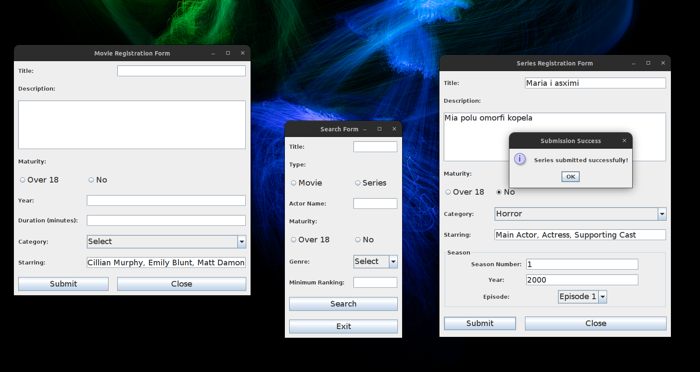
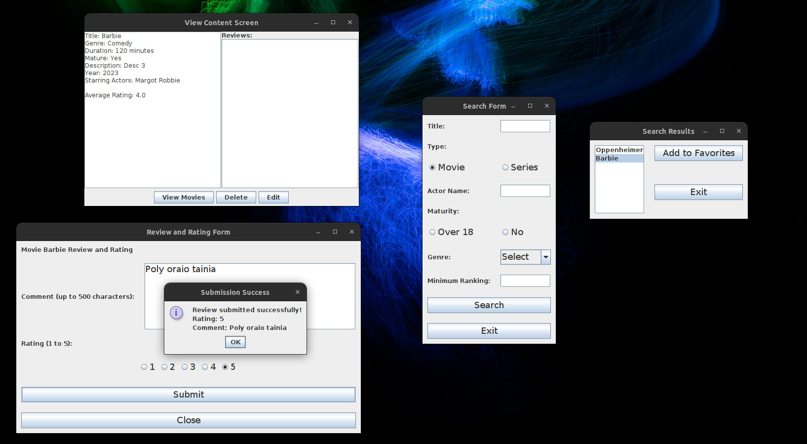
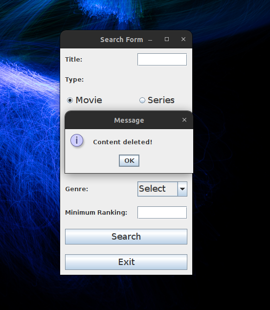

# Project Documentation

- The classes Movie, Season, User.
  - Have a static List where all created objects are stored, making them accessible throughout the program.

- The class Controllers.FileController is a helper class for better organization (writing/reading) of files.
- The class Controllers.FileController initializes default movies, series, and users in files through a suitable method.
- Any change in the createDefaultValues function of the Controllers.FileController class will start the program with different initial values if the function is executed from the Main.
- The class Controllers.GuiController is a helper class for better management of graphical elements.

# Program Operation

- The LogInForm screen is displayed to the user. If the user's login is successful, the corresponding screens are displayed, depending on the user type (user/admin). If the login fails, it indicates a new user, and the UserRegistrationForm screen opens.
- Once the user successfully creates an account, they return to the login screen.
- If the user already exists, they return to the login screen.
- After a successful login for a subscriber, the SearchForm screen is displayed.
- The user, after entering the appropriate login details, sees the SearchResultScreen, showing all movies or series matching the search.
- In the SearchResultScreen, the user can add a movie or series to their 'favorites' (the user file is updated).
- If the user selects a series or movie, they can also write a review for it, which is stored after submission.
- If they have already written a review, it is displayed.
- If an administrator logs in, in addition to searching, they can Create Movie and Create Series.
- In the MovieRegistrationForm screen, by filling in the appropriate fields, they can create a movie that will be saved in the corresponding file.
- In the SeriesRegistrationForm screen, by filling in the appropriate fields, they can create a series that will be saved in the corresponding file.
- The administrator can delete a movie or series. Changes are saved in the files.
- The administrator can read information from movies and series.

# Indicator Screens

